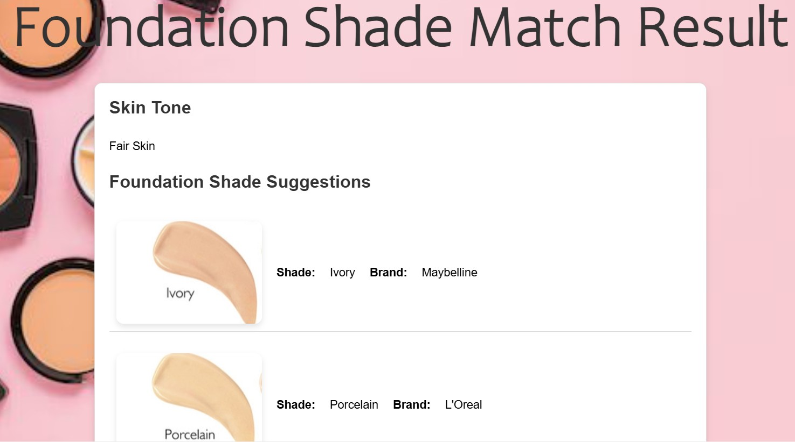

# Foundation Shade Matcher

A web-based application that analyzes facial skin tone from images and recommends suitable foundation shades from different cosmetic brands.

---

## Overview

This project detects skin tone using RGB values extracted from a selected facial region. Based on predefined RGB ranges, the system classifies the skin tone and suggests matching foundation shades along with brand information and images.

---

## Features

* Upload image and select facial region
* Extract RGB values from the selected area
* Classify skin tone (Fair, Light, Medium, Olive, Dark, Deep Dark)
* Recommend foundation shades from multiple brands
* Display product images with suggestions
* Dynamic interaction between frontend and backend

---

## Tech Stack

### Frontend

* HTML
* CSS
* JavaScript

### Backend

* Python
* Flask
* Flask-CORS

----

### how it works

1. User uploads an image
2. User selects a facial region
3. RGB values are extracted from the selected area
4. Backend calculates the average RGB values
5. Skin tone is classified using predefined ranges
6. Matching foundation shades are suggested
7. Results are displayed on the result page

---

## Core Logic

### Skin Tone Classification

The system uses rule-based classification with RGB ranges to determine skin tone categories.

### Foundation Recommendation

Each skin tone is mapped to:

* Shade name
* Brand
* Product image

---

## Project Structure

```
foundation-shade-matcher/
├── backend/
├── frontend/
├── images/
├── screenshots/
├── README.md
```

---

## How to Run the Project

1. Clone the repository

```
git clone https://github.com/kanchanbmanduma/foundation-shade-matcher.git
```

2. Navigate to the project folder

```
cd foundation-shade-matcher
```

3. Install dependencies

```
pip install flask flask-cors
```

4. Run the backend

```
python app.py
```

5. Open in browser

```
http://127.0.0.1:5000


## Screenshots





## Future Improvements

* Improve accuracy using machine learning
* Add image processing using OpenCV
* Deploy the project online
* Improve user interface


## Author

Kanchan Rai
IT Engineer
